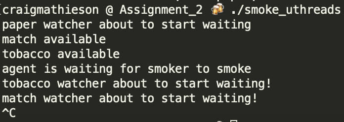
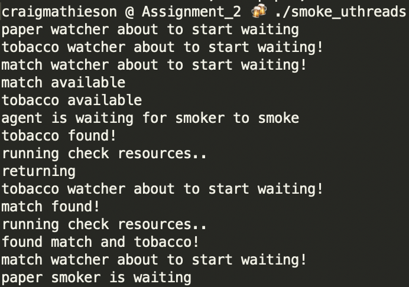

# Synchronization-Concurrency

## Producer - Consumer Problem
- Mutex locking using pthreads -> pc_mutex_cond_pthread.c
- Mutex locking using uthreads -> pc_mutex_cond_uthread.c
- Spinlocking using uthreads -> pc_spinlock_uthread.c
- Semaphores using pthreads -> pc_sem_pthread.c
- Semaphores using uthreads -> pc_sem_uthread.c

## Smoker's Problem 
- pthreads -> smoke_pthread.c
- uthreads -> smoke_uthread.c

## Running Locally
All problems are Makefile targets, so just:
```shell
make <program name>
```

## Issues encountered
- running on macOS, pthread semaphores are depreciated
- Also on macOS, running Smoker's problem sometimes resulted in the agent thread giving out resources before listeners had started polling, causing deadlock.
\n
Adding a 50ms delay once the agent thread was created seemed to give enough time for everything to catch up.

